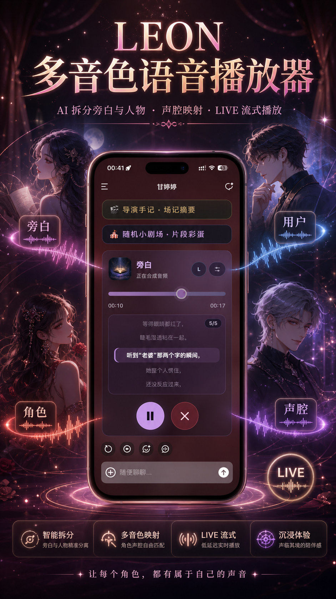

# LEON IndexTTS2 Tavo Voice Player

LEON is a local IndexTTS2 integration for Tavo. It turns a Tavo chat message into a multi-role voice player: AI can split narration, user lines, and character dialogue, map each role to a configured voice, stream audio while synthesis is still running, and keep saved audio history for replay.

<p align="center">
  
</p>

## What It Does

- Multi-role TTS for Tavo messages, including narrator, user, current character, and custom roles.
- AI-assisted role and style parsing for dialogue-heavy text.
- LIVE streaming playback before the final cache audio is saved.
- Saved/cache audio playback with native browser audio for replay, seek, and mobile background behavior.
- Local launcher flow for choosing the `vllm` or `fast6g` backend.

## How It Runs

Start from the root launcher:

```text
D:\apiWorkSpace\leon_api\LEON-Launcher.exe
```

The launcher selects one API backend:

- `vllm/`: quality-oriented backend.
- `fast6g/`: lower-VRAM friendly backend.

The shared Tavo frontend is served from `static/`. Same-LAN Tavo testing can load:

```html
<script src="http://<LAN-IP>:9880/static/tavo.js?v=20260607-tavo-file-v31"></script>
```

For public access, configure your own tunnel or reverse proxy outside this repository and replace only the script host.

## Workspace Layout

- `static/`: Tavo injected frontend, runtime parts, CSS, and test page.
- `vllm/`: vLLM API backend.
- `fast6g/`: 6 GB friendly API backend.
- `launcher/`: Windows launcher source and assets.
- `scripts/`: shared startup scripts.
- `dev_workspace/`: Codex handoff docs, regression notes, and smoke tests.
- `assets/readme/`: README visuals.

## Codex Work Notes

This root README is the project introduction. For repository work, debugging, handoff, or future Codex sessions, use:

```text
dev_workspace\README.md
```

That file is the active working README and links to the current state, bug ledger, and regression checklist.

<p align="center">
  
</p>
