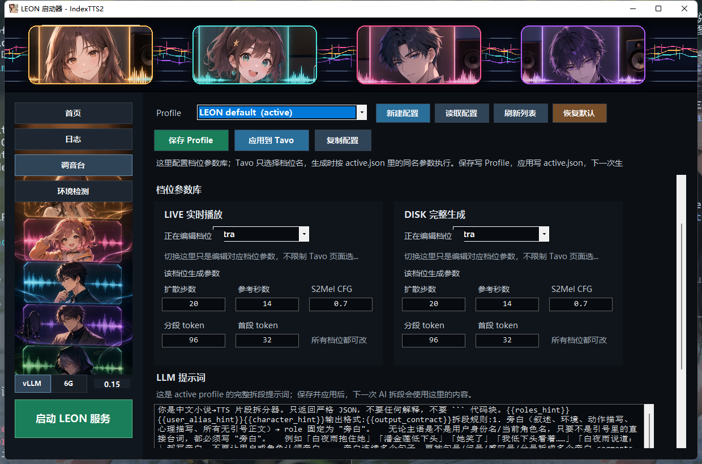

# LEON 本地语音工坊

LEON 是一套本机运行的 IndexTTS2 + Tavo 语音生成工具。Windows 启动器负责启动本地服务、查看日志、检查环境，并提供“调音台”维护生成配置；Tavo 侧只负责选择档位、发起生成和播放音频。

<p align="center">
  
</p>

## 核心能力

- 启动器一键启动/停止本地 API 服务，可切换 `vllm` 和 `fast6g`。
- 调音台可以新建、复制、保存、应用 Profile，不需要手写 JSON。
- 每个 Profile 内维护 LIVE 实时播放和 DISK 完整生成的全部档位参数。
- Tavo 页面只选择 `fast` / `balanced` / `expressive` / `ultra` / `custom` 档位，实际参数从当前应用的 Profile 读取。
- AI 拆段提示词来自 Profile 的 `llmPrompt`，保存并应用后，下一次生成使用新提示词。
- 支持 LIVE MP3 实时播放；音频落盘后走完整缓存播放，方便重播、拖动进度和移动端后台播放。

## 快速启动

双击根目录启动器：

```text
D:\apiWorkSpace\leon_api\LEON-Launcher.exe
```

启动器不会在打开时自动启动服务。选择后端后点击启动：

- `vllm/`：质量优先后端，适合显存余量更充足的场景。
- `fast6g/`：低显存友好后端，适合更保守的本地运行。

## Tavo 接入

同一局域网内测试时，在 Tavo 注入脚本里加载：

```html
<script src="http://<LAN-IP>:9880/static/tavo.js?v=20260609-mp3-cache-v63"></script>
```

如需公网访问，请在仓库外配置隧道或反向代理，只替换脚本地址中的主机部分。项目代码不会保存公网域名或密钥。

## 配置方式

Profile 文件位于：

```text
config/profiles/
```

- `leon-default.json`：默认配置模板。
- `active.json`：当前应用到运行时的配置快照。

正常使用时通过启动器调音台创建、复制、编辑和应用配置。业务生成读取 `/profiles/active` 暴露的当前配置；代码内默认参数只作为缺失配置时的兜底。

## 目录说明

- `launcher/`：Windows 启动器源码。
- `scripts/`：启动器调用的共享启动脚本。
- `static/`：Tavo 注入前端、runtime 分片和测试页面。
- `vllm/`：vLLM API 后端。
- `fast6g/`：6 GB 友好 API 后端。
- `config/profiles/`：启动器调音台配置。
- `assets/readme/`：README 展示截图。
- `dev_workspace/`：开发交接文档、回归记录和 smoke 测试。

## 开发约束

修改 Tavo 播放、生成、离线音频、退出 LIVE、消息级缓存或 LLM 复用前，先读：

```text
dev_workspace/docs/LOGIC.md
```

核心边界：没有“live 卡”，只有普通音频卡和 LIVE 页面；历史/已落盘音频只播放完整缓存音频，不能重新进入 LIVE 路径。
