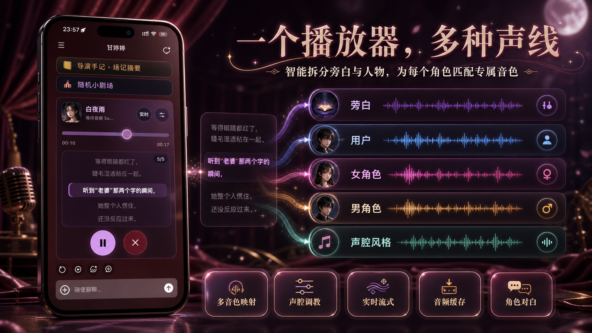

# LEON IndexTTS2 Tavo 语音播放器

LEON 是面向 Tavo 的本地 IndexTTS2 集成。它可以把 Tavo 聊天消息变成多角色语音播放器：AI 负责拆分旁白、用户台词和角色对白，并把每个角色映射到配置好的音色；音频合成过程中可先进行 LIVE 流式播放，完成后保留历史音频，方便重播。

<p align="center">
  
</p>

## 功能

- 为 Tavo 消息生成多角色 TTS，支持旁白、用户、当前角色和自定义角色。
- 使用 AI 辅助解析对话文本中的角色和风格。
- 最终缓存音频保存前，支持 LIVE 流式播放。
- 已保存/缓存音频使用原生浏览器音频播放，便于重播、拖动进度和移动端后台播放。
- 通过本地启动器选择 `vllm` 或 `fast6g` 后端。

## 运行方式

从根目录启动器运行：

```text
D:\apiWorkSpace\leon_api\LEON-Launcher.exe
```

启动器会选择一个 API 后端：

- `vllm/`：质量优先后端。
- `fast6g/`：更适合低显存环境的后端。

共享的 Tavo 前端由 `static/` 提供。同一局域网内测试 Tavo 时可加载：

```html
<script src="http://<LAN-IP>:9880/static/tavo.js?v=20260607-tavo-file-v31"></script>
```

如需公网访问，请在仓库外自行配置隧道或反向代理，只替换脚本地址中的主机部分。

## 工作区结构

- `static/`：Tavo 注入前端、runtime 分片、CSS 和测试页面。
- `vllm/`：vLLM API 后端。
- `fast6g/`：适合 6 GB 显存的 API 后端。
- `launcher/`：Windows 启动器源码和素材。
- `scripts/`：共享启动脚本。
- `dev_workspace/`：Codex 交接文档、回归记录和 smoke 测试。
- `assets/readme/`：README 图片素材。
