# 🎙️ LEON 本地语音工坊

**LEON 本地语音工坊** 是一套本机运行的 **IndexTTS2 + Tavo** 语音生成工具。

它的目标很直接：让 Tavo 社区玩家不用从 Python、模型、启动脚本、缓存、播放状态一路手搓到崩溃，解压、启动、接入 Tavo，就能开始玩本地角色语音。✨

你在 Tavo 里看角色聊天时，LEON 可以把消息拆成多角色台词，按角色匹配不同音色生成语音；生成好的音频还能保存到 Tavo 本地文件里，下次不想开服务也能回放已保存音频。🎧

## ✨ 先看效果

🏠 启动器首页：选择 vLLM 或 6G 后手动启动服务。

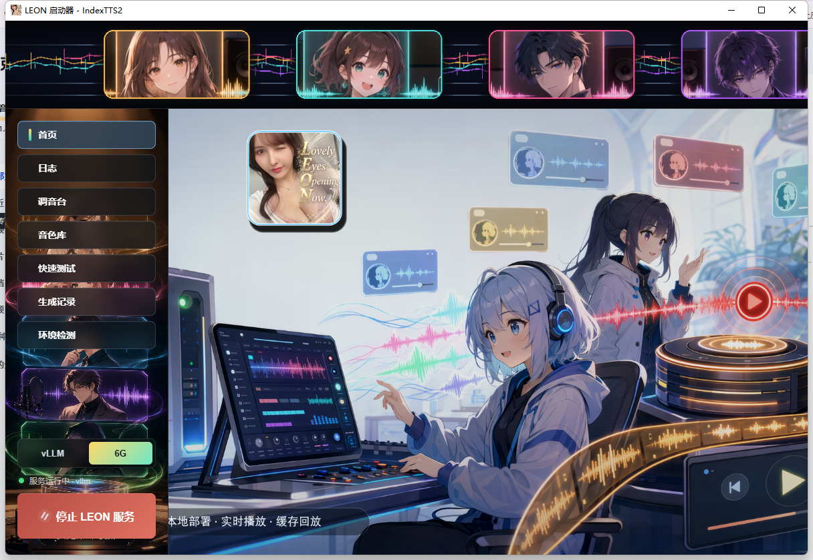

📜 日志页：启动、错误、RTF 等信息可以筛选，方便看服务到底卡在哪。

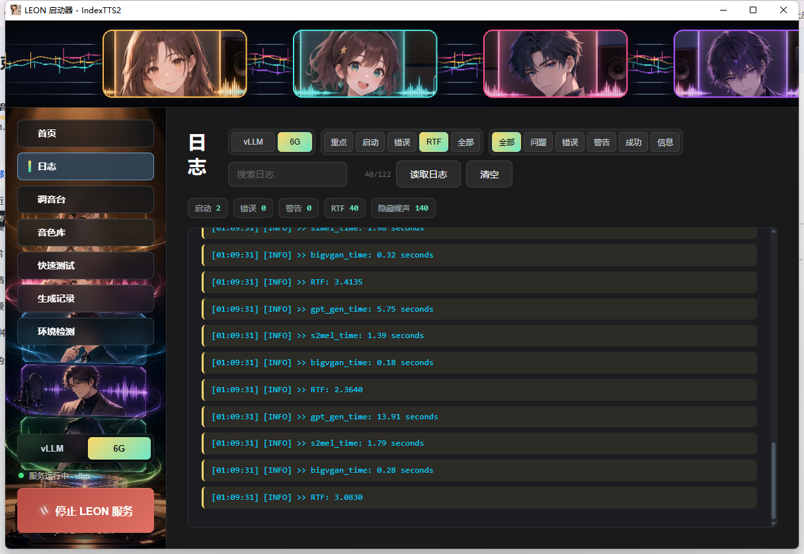

🎛️ 调音台：这里不是普通“配置页”，更像是给角色语音做调教的工作台。可以管理不同档位、拆段规则、声腔选择规则、LIVE/DISK 参数、声腔参考音频和强度。

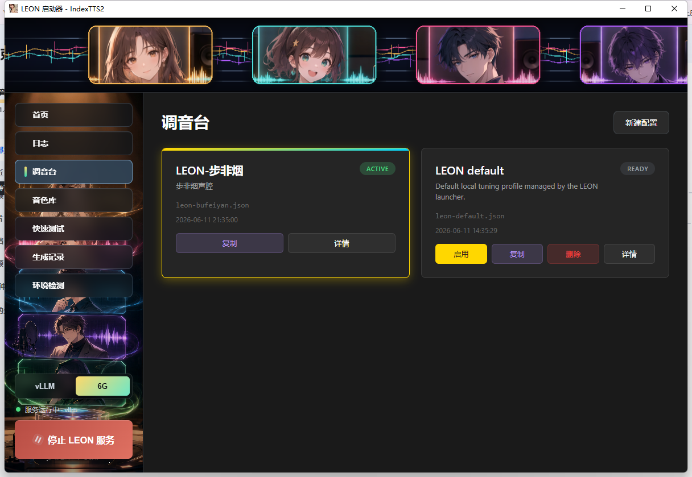

🎚️ 配置详情：可以选默认档位，分别调 LIVE / DISK 的生成参数，比如扩散步数、参考秒数、分段 tokens、top_p、top_k、temperature、重复惩罚等。

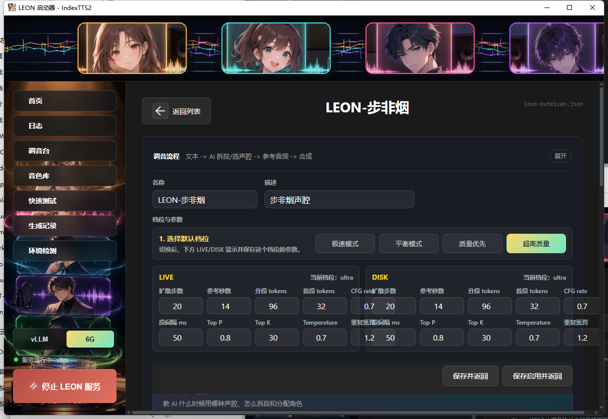

🧠 AI 声腔调教：可以直接教 AI 怎么拆段、什么时候用耳语/哭腔/惊喘/低吟，怎么分配旁白和角色，不想全靠默认规则瞎猜。

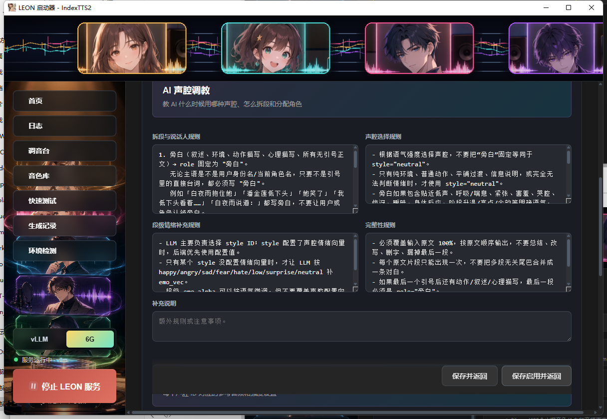

🎭 声腔库：每个 style ID 都能单独配置，AI 选中 `whisper_soft`、`cry_soft`、`gasp_surprise` 这类声腔时，就会按这里的规则去合成。

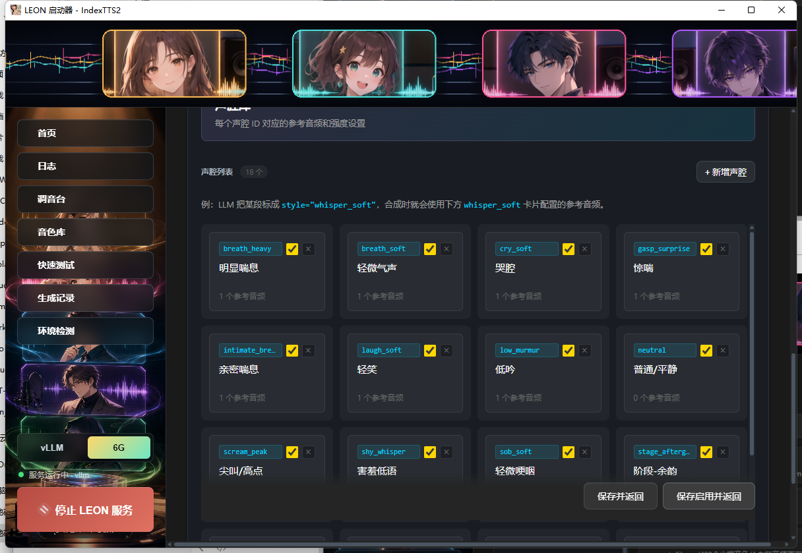

🔧 声腔详情：每个声腔都能调显示名、适用场景、参考音频、强度、情绪权重和情绪向量。比如“明显喘息”这种，就可以挂对应参考音频，再调出更贴近的表达。

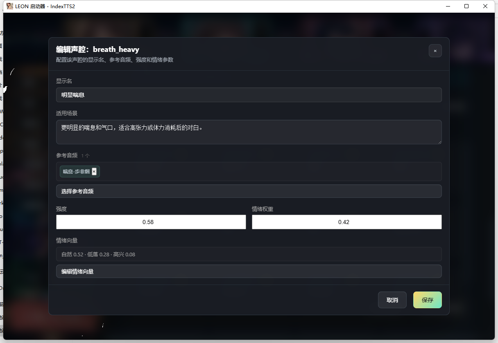

🎙️ 音色库：本地管理音色素材，支持分组、搜索、预览、导入。

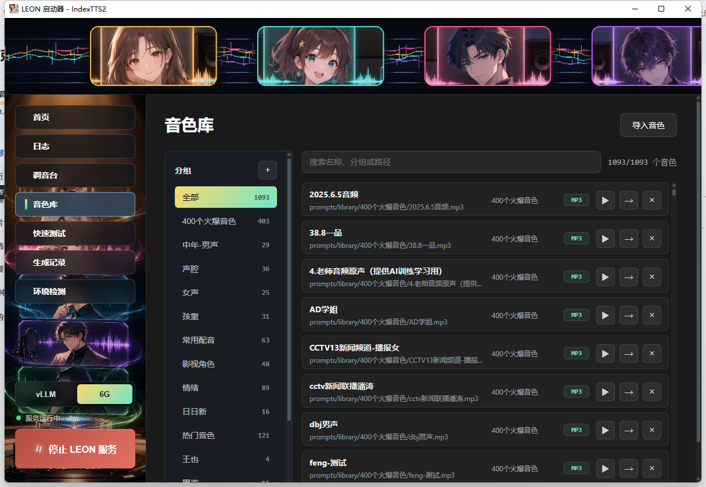

⚡ 快速测试：可以先选音色 / 声腔生成试听。注意：**生成试听需要 LEON 服务已经启动**；本地参考音频预览不需要生成服务。

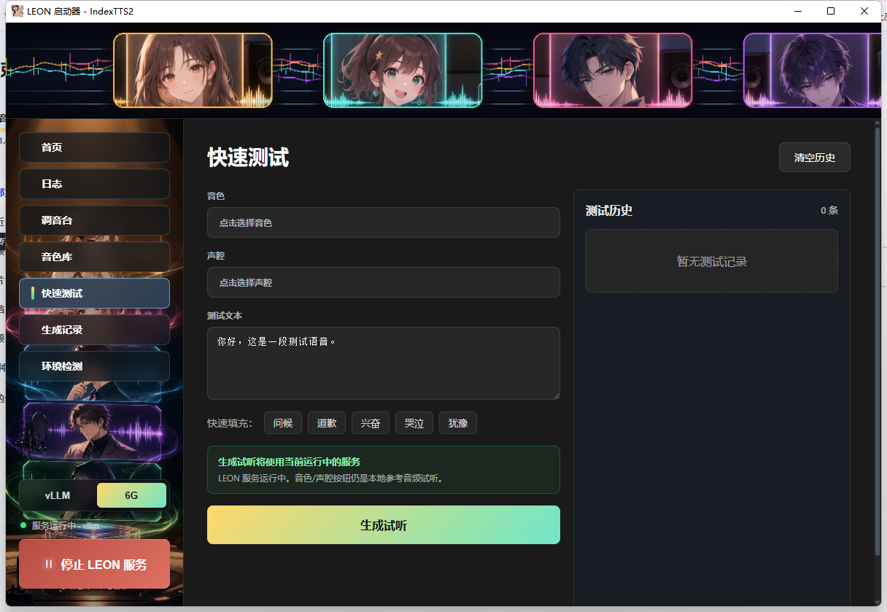

🧾 生成记录：可以回看最近生成的音频、RTF、耗时、档位和分段详情。

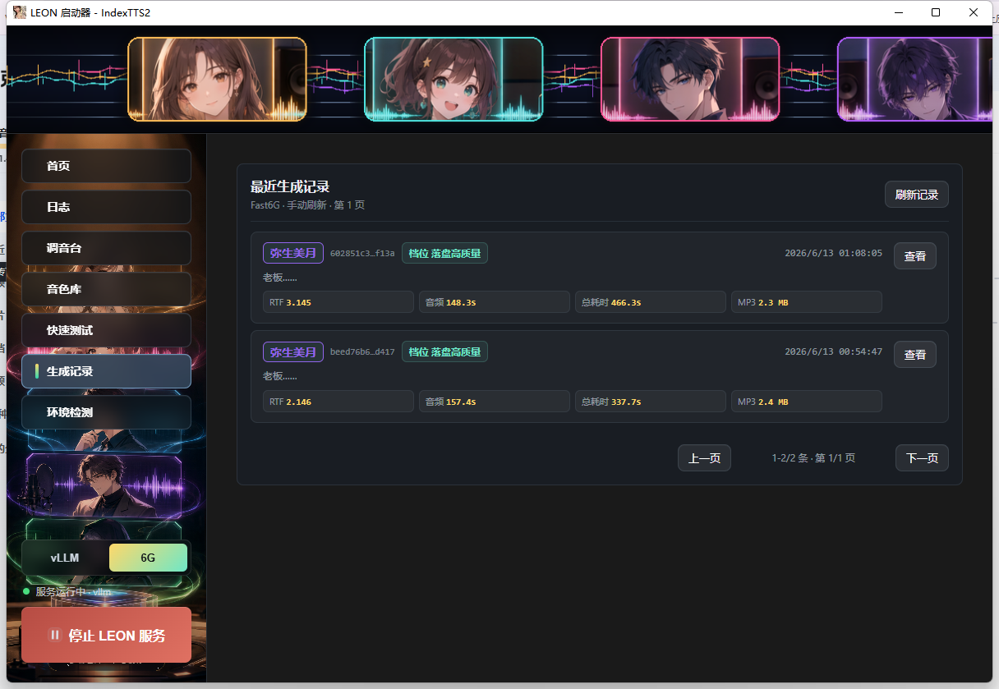

🩺 环境检测：手动检测本地环境，一键修复只处理安全项。

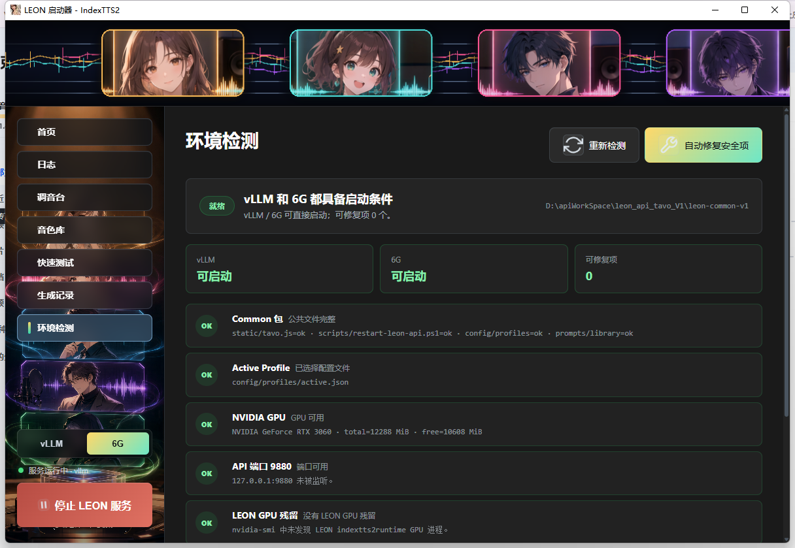

## 📦 发布包怎么选

下载地址：

- 夸克网盘：<https://pan.quark.cn/s/4df1438fcd58>
- 提取码：`DnmH`

发布版拆成 3 个 7z 包：

- `leon-common-v1.7z`：公共包，**必装**，包含启动器、共享脚本、Tavo 前端、配置、音色库等公共文件。
- `leon-vllm-v1.7z`：vLLM 引擎包，偏质量和实时播放体验，推荐显存比较宽裕的机器。
- `leon-fast6g-v1.7z`：6G 友好引擎包，低显存兜底，能跑但实时流式播放不一定丝滑，RTF 高时更推荐 DISK 完整生成。

安装组合：

- 最少安装：`common + vllm` 或 `common + fast6g`
- 想两个都留着切换：`common + vllm + fast6g`
- 只下 `common` 不行，因为没有 TTS 引擎和模型。

模型和运行所需文件跟对应引擎包走，正常不用再单独下载模型。

## 🧰 安装方式

1. 安装 7-Zip，用它解压发布包。
2. 先解压 `leon-common-v1.7z`。
3. 再把 `leon-vllm-v1.7z` 或 `leon-fast6g-v1.7z` 解压到同一个目录。
4. 最终目录里应该能看到 `LEON-Launcher-Tauri.exe`，以及 `static`、`scripts`、`config`、`prompts`、`vllm` 或 `fast6g` 等目录。
5. 双击 `LEON-Launcher-Tauri.exe`。
6. 在启动器左下角选择 `vLLM` 或 `6G`。
7. 点击启动服务，等服务状态变成运行中。
8. 打开 Tavo，使用下面的脚本接入。

解压完成后，目录大概长这样。红框里的 `vllm` 和 `fast6g` 就是两个可选引擎目录；启动器里 `fast6g` 显示为 `6G`。📁

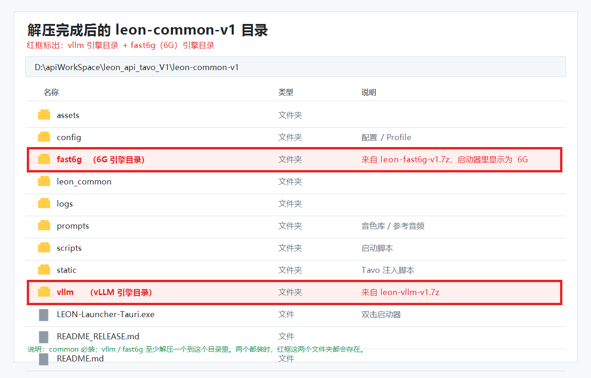

启动器打开时不会自动启动后端，也不会一打开就强制跑环境检测，避免上来就卡住。需要检测就去“环境检测”页手动点“重新检测”。

## 🖥️ 需要什么环境

建议环境：

- Windows 10 / Windows 11
- NVIDIA 显卡和正常可用的 NVIDIA 驱动
- 端口 `9880` 没被别的程序占用
- 7-Zip 用来解压
- Tavo 里开启高级渲染 / 允许脚本执行

显存建议：

- vLLM：推荐显存更宽裕的 NVIDIA 显卡，实时体验更好。
- fast6g：面向 6GB 显存机器的版本，适合低显存用户先跑起来。

注意：显卡驱动、系统 CUDA 能力、端口占用、显存被其他程序吃掉，这些不是一键修复能包治的东西。环境检测里的自动修复只会处理安全的本地问题，比如补目录、补默认配置、清理 LEON 自己残留的异常进程等。

## 🔌 Tavo 怎么接

在 Tavo 的高级渲染 / 正则注入里，把脚本挂进去：

```html
<script src="http://127.0.0.1:9880/static/tavo.js?v=20260613-mp3-catchup-v72"></script>
```

如果是在同一局域网的手机或平板上用 Tavo，把 `127.0.0.1` 换成电脑的局域网 IP，例如：

```html
<script src="http://电脑IP:9880/static/tavo.js?v=20260613-mp3-catchup-v72"></script>
```

本地电脑用就是 `127.0.0.1`。外网访问需要自己处理隧道或反代，这个工具本身按本地服务设计。

## 🤖 Tavo 里的 LLM 配置

LEON 的 AI 多角色语音需要一个 LLM 来做“拆段 + 判断说话人 + 选择声腔”。这里不是用 Tavo 自己正在聊天的模型，而是由 **LEON 后端** 去调用你填的 OpenAI 兼容 Chat 接口。

在 Tavo 里打开 LEON 播放器设置，找到这几项：

- `LLM 接口地址`：写到 `/v1` 就行，例如 `http://127.0.0.1:8317/v1` 或你的 OpenAI 兼容网关地址。
- `LLM 模型`：填接口里可用的模型名，例如 `gpt-4o-mini`、`qwen-plus`、本地网关里的模型名等。
- `LLM Key`：如果接口需要鉴权就填；本地无鉴权接口可以留空。
- `复用 LLM 拆段`：建议打开。同一条消息重复生成时，可以复用上次拆好的分段，少等一次 LLM。

接口地址可以这样写：

```text
https://api.openai.com/v1
http://127.0.0.1:8317/v1
http://127.0.0.1:8317/v1/chat/completions
```

写到 `/v1` 时，LEON 会自动补成 `/v1/chat/completions`；如果你直接写完整的 `/chat/completions`，也可以。

兼容要求也很简单：只要你的服务支持 OpenAI Chat Completions 风格，一般就能用。也就是能接收 `model`、`messages`、`temperature`、`stream:false` 这类字段，并返回 `choices[0].message.content`。最好支持 JSON 输出；不支持也能试，但模型必须按提示返回严格 JSON，不然 LEON 没法解析角色分段。

如果没填 LLM 地址或模型，AI 模式会直接报错；这时候可以改成普通拆分模式，或者先把 LLM 配好再生成。⚠️

## 🚀 主要功能

**Tavo 侧：**

- 🎵 一条消息生成一个语音卡片。
- 🧠 AI 分段，把旁白、角色对白拆开。
- 👥 角色多音色，每个角色可以绑定不同音色。
- 🎭 声腔 / 情绪参考，让同一个音色有不同表达。
- 🔴 LIVE 实时播放，边生成边听。
- 💿 DISK 完整生成，等音频落盘后再播放。
- 📖 歌词 / 分段同步，播放时能跟着文本走。
- ⏮️ 历史音频回放、进度拖动、上一段 / 下一段。
- 📦 Tavo 本地离线保存：已保存的音频可优先从 Tavo 本地文件播放。

**启动器侧：**

- 🚦 一键启动 / 停止本地 LEON 服务。
- 🔀 vLLM / 6G 两套引擎可切换。
- 🎛️ 调音台管理配置档位和用户调教规则。
- 🎙️ 音色库本地管理和预览。
- ⚡ 快速测试音色、声腔和生成效果。
- 🧾 生成记录查看历史音频、RTF、耗时和分段详情。
- 📜 日志页筛选启动、错误、RTF 等关键日志。
- 🩺 环境检测页检查公共包、配置、GPU、端口、引擎包和模型文件。

## 🎛️ 用户调教功能：重点在这里

调音台是这版最适合玩家折腾的地方。它不只是“选一个音色”，而是把 Tavo 文本到最终语音的链路拆开，让你能一层层调：

- 🧩 **拆段规则**：告诉 AI 旁白、动作、心理描写、角色对白应该怎么切，不要把一大坨文本糊成一段。
- 👥 **角色分配**：让 AI 判断每段该是谁说的，旁白归旁白，角色对白归对应角色。
- 🎭 **声腔选择规则**：教 AI 什么时候用普通、耳语、低吟、哭腔、惊喘、轻笑、阶段升温等 style。
- 🎚️ **LIVE / DISK 参数**：实时播放和完整落盘可以分开调，想更快还是想更稳，可以自己选档位。
- 🎧 **参考音频绑定**：每个声腔 ID 可以挂一个或多个参考音频，不再只靠文本提示。
- 🔥 **强度和情绪权重**：同一个参考音频可以调得更轻、更明显、更贴近角色当前情绪。
- 🧪 **情绪向量**：happy、sad、fear、surprise、low 等方向可以细调，适合想继续打磨角色表现的人。

举个例子：AI 把某段标成 `style="whisper_soft"`，合成时就会去调音台里找 `whisper_soft` 的配置，用你绑定的参考音频、强度和情绪权重生成。这样不同角色不只是“换个声音”，还能有不同说话状态。✨

## 🧭 vLLM 和 6G 怎么选

如果你的显存够，想要更好的 LIVE 实时体验，优先试 `vLLM`。

如果你的显存比较紧，比如 6GB 级别，先用 `fast6g`。它的定位是“先让大家跑起来”，不是追求极限实时流式。RTF 如果大于 1，说明生成速度追不上播放速度，LIVE 就可能卡顿；这种情况建议切到 DISK 完整生成。

## 💡 使用小提示

- 第一次启动会加载模型，慢一点很正常。
- 第一次生成也可能有暖机时间。
- 快速测试里的“生成试听”必须服务已经启动，否则会失败。
- Tavo 里已经保存过的音频，后面可以走本地离线回放。
- 如果 Tavo 里脚本没有反应，先检查高级渲染 / JS 是否开启，再检查 `9880` 服务是否启动。
- 如果服务启动不了，先看环境检测，再看日志页的错误和 RTF 信息。

## 🧱 仓库目录

- `launcher-tauri/`：Tauri 桌面启动器源码。
- `scripts/`：启动器调用的共享启动脚本。
- `static/`：Tavo 注入前端、runtime 分片和测试页面。
- `vllm/`：vLLM API 后端。
- `fast6g/`：6GB 显存友好 API 后端。
- `config/profiles/`：启动器调音台配置。
- `assets/readme/`：README 展示截图。
- `dev_workspace/`：开发交接文档、回归记录和 smoke 测试。

## 🌱 当前定位

这不是云端 SaaS，也不是点开网页就能用的在线服务；它是给 Tavo 玩家用的本地语音工具。

如果你机器显存一般，先用 6G 包跑通；如果你想要更好的实时体验，再试 vLLM 包。欢迎大家把自己的显卡、显存、RTF、角色配置和踩坑反馈发出来，后面继续一起把它磨顺。🙌

开发者修改 Tavo 播放、生成、离线音频、退出 LIVE、消息级缓存或 LLM 复用前，先读 `dev_workspace/docs/LOGIC.md`。核心边界：没有“live 卡”，只有普通音频卡和 LIVE 页面；历史/已落盘音频只播放完整缓存音频，不能重新进入 LIVE 路径。
